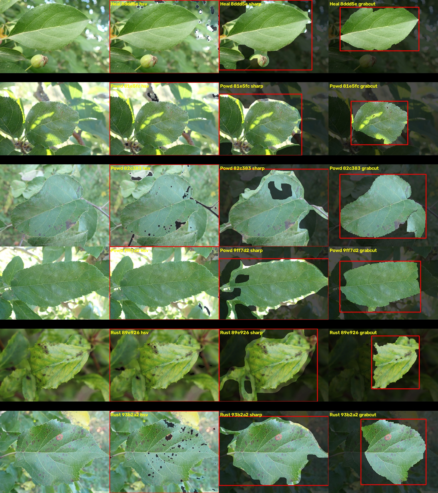
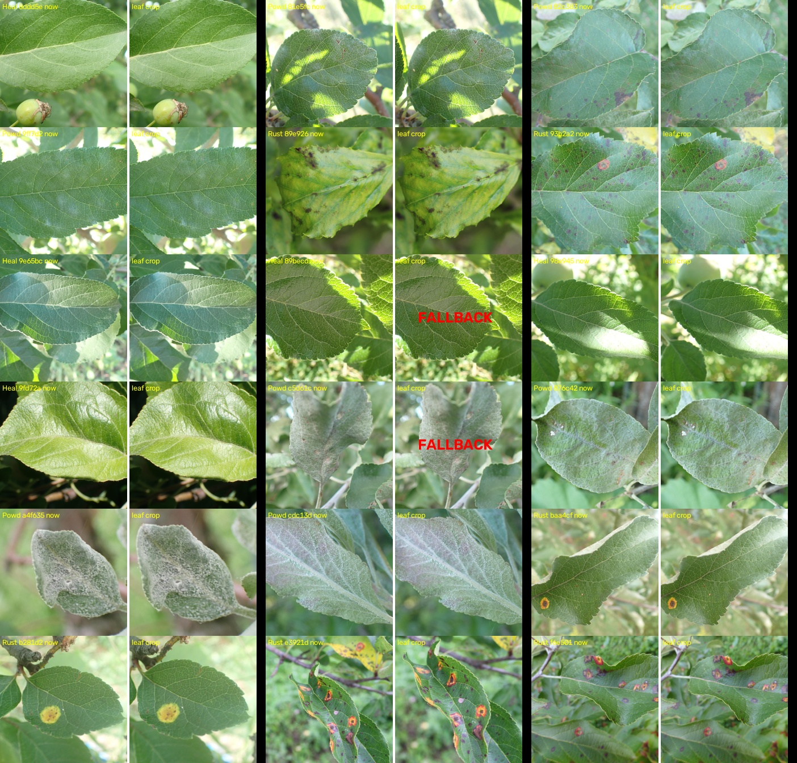

# PyTorch Fundamentals — Building Toward a Plant Disease Classifier

A step-by-step learning project working through PyTorch's core concepts, then
benchmarking a real hardware constraint to make an informed architecture
decision for a downstream plant disease classification project.

Each step is a self-contained, runnable script. The progression is deliberate:
every script changes one thing about the previous one, so the effect of that
change is measurable in isolation.

---

## Environment

| | |
|---|---|
| CPU | AMD Ryzen 7 PRO 6850U (4 cores available to the VM) |
| RAM | 15 GB |
| GPU | **None** — CPU-only training throughout |
| PyTorch | 2.14.0+cpu |
| torchvision | 0.29.0+cpu |
| OS | Debian Linux 6.12 (VM) |

The absence of a dedicated GPU is the central constraint of this project and
drives the final architecture decision in Step 4.

---

## Step 1 — Baseline: a fully-connected network

**File:** [`quickstart.py`](quickstart.py)
**Dataset:** FashionMNIST (28x28 grayscale, 10 clothing classes)

Follows the [official PyTorch quickstart](https://docs.pytorch.org/tutorials/beginner/basics/quickstart_tutorial.html)
to establish the fundamental workflow:

1. Load a `Dataset`, wrap it in a `DataLoader` for batching
2. Select a compute device (CUDA / MPS / CPU)
3. Define a model as an `nn.Module` subclass with a `forward()` method
4. Choose a loss function and optimizer
5. Loop: forward pass → compute loss → `backward()` → `optimizer.step()` → `zero_grad()`
6. Save weights with `state_dict()`, reload, and run inference

**Architecture:** `Flatten → Linear(784, 512) → ReLU → Linear(512, 512) → ReLU → Linear(512, 10)`
**Optimizer:** SGD, lr=1e-3, 5 epochs

### Results

| Epoch | Test accuracy |
|---:|---:|
| 1 | 47.8% |
| 2 | 59.4% |
| 3 | 62.4% |
| 4 | 63.2% |
| 5 | **64.4%** |

Accuracy was still climbing at epoch 5 — the model was under-trained, not
converged. This matters for interpreting Step 2.

### Key concept

`Flatten` destroys spatial structure. A 28x28 image becomes a flat 784-vector,
so the model has no notion that two pixels are adjacent. It must learn every
pixel position as an independent, unrelated feature. This is the specific
weakness Step 2 addresses.

---

## Step 2 — Convolutional network

**File:** [`quickstart_cnn.py`](quickstart_cnn.py)
**Dataset:** FashionMNIST (unchanged, for a controlled comparison)

**What changed from Step 1:**

| | Step 1 | Step 2 |
|---|---|---|
| Feature extraction | `Flatten` → `Linear` | 2x (`Conv2d` → `ReLU` → `MaxPool2d`) |
| Optimizer | SGD | Adam |
| Inference input | `[1, 28, 28]` | `[1, 1, 28, 28]` (explicit batch dim) |

**Architecture:**
```
Conv2d(1 → 32, 3x3, pad=1) → ReLU → MaxPool2d(2)   # 28x28 → 14x14
Conv2d(32 → 64, 3x3, pad=1) → ReLU → MaxPool2d(2)  # 14x14 → 7x7
Flatten → Linear(3136, 128) → ReLU → Linear(128, 10)
```

### Results

| Epoch | Test accuracy |
|---:|---:|
| 1 | 87.2% |
| 2 | 87.5% |
| 3 | 88.0% |
| 4 | 88.8% |
| 5 | **89.2%** |

**89.2% vs 64.4%** on identical data and epoch count.

### Key concepts

- **Convolutions learn spatially-local, position-invariant features.** A kernel
  that detects an edge works anywhere in the image, so the model learns *one*
  edge detector instead of a separate one per pixel location. For plant disease
  this is exactly right: a lesion is a lesion regardless of where on the leaf it
  appears.
- **Adam converged far faster than SGD.** Loss dropped below 0.7 within the
  first epoch, versus SGD's slow crawl from 2.30.
- **`Conv2d` requires a 4D tensor `[N, C, H, W]`.** Step 1's inference code
  passed a 3D `[1, 28, 28]` tensor and worked by accident: `Flatten(start_dim=1)`
  treated the single channel as the batch dimension. Convolution has no such
  tolerance, so `.unsqueeze(0)` became necessary. Shape debugging is a routine
  part of working with image tensors.

---

## Step 3 — Color images of arbitrary size

**File:** [`quickstart_cnn_rgb.py`](quickstart_cnn_rgb.py)
**Dataset:** CIFAR-10 (32x32 **color**, 10 classes)

FashionMNIST is single-channel and fixed-size, which is nothing like real plant
photographs. This step adapts the pipeline to 3-channel input of arbitrary
source resolution. CIFAR-10 serves as a stand-in: it is genuinely color, ships
with torchvision, and requires no manual data collection.

**What changed from Step 2:**

| | Step 2 | Step 3 |
|---|---|---|
| Transform | `ToTensor()` | `Resize((64, 64))` → `ToTensor()` |
| First conv | `Conv2d(1, 32, ...)` | `Conv2d(**3**, 32, ...)` |
| Conv blocks | 2 | 3 (deeper, for larger input) |
| Batch size | 64 | 128 |
| Shuffle | no | `shuffle=True` on train loader |

**Architecture:**
```
Conv2d(3 → 32)  → ReLU → MaxPool2d(2)   # 64x64 → 32x32
Conv2d(32 → 64) → ReLU → MaxPool2d(2)   # 32x32 → 16x16
Conv2d(64 → 128)→ ReLU → MaxPool2d(2)   # 16x16 → 8x8
Flatten → Linear(8192, 256) → ReLU → Linear(256, 10)
```

### Results

3 epochs (reduced from 5 — see runtime note below):

| Epoch | Test accuracy |
|---:|---:|
| 1 | 54.8% |
| 2 | 62.5% |
| 3 | **66.5%** |

Batch shape confirmed as `torch.Size([128, 3, 64, 64])` — 3 channels at the
resized resolution, verifying the RGB path works end to end.

**66.5% is not a regression from Step 2's 89.2%.** CIFAR-10 (separating cats
from dogs from trucks in cluttered natural photos) is a substantially harder
problem than FashionMNIST (centered garments on black backgrounds), and it got
3 epochs rather than 5.

### Key concepts

- **`Resize` is what makes arbitrary-resolution input possible.** Real photos
  arrive at whatever resolution the camera produced, but a network with fully-
  connected layers requires a fixed input size. Resizing at the transform stage
  normalizes this before the tensor ever reaches the model.
- **The flattened dimension is a function of input size.** At 64x64 with three
  pooling layers the feature map is 128x8x8 = 8192. Change `IMAGE_SIZE` and this
  must change with it — a common source of shape errors.
- **Runtime became a real constraint.** ~25 minutes of CPU time for 3 epochs on
  50,000 small images. This directly motivated Step 4.

### Applying this to real data

The pipeline is already dataset-agnostic. Swapping in real plant photos requires
one line:

```python
training_data = datasets.ImageFolder("path/to/plant_data", transform=transform)
```

`ImageFolder` infers class labels from subdirectory names, so a layout of
`plant_data/healthy/`, `plant_data/powdery_mildew/`, ... works directly. Only
`num_classes` needs updating to match.

---

## Step 4 — Hardware benchmark: can transfer learning work without a GPU?

**File:** [`benchmark_cpu.py`](benchmark_cpu.py)

Step 3 established that CPU-only training is slow. Before scaling up to real
plant photos, the question to settle is whether **transfer learning** (starting
from an ImageNet-pretrained backbone instead of random weights) is viable on
this hardware.

The concern is that transfer learning cuts both ways:

- **Against it:** pretrained models expect 224x224 input — roughly 12x the
  pixels of Step 3's 64x64 — and the backbones are much larger than the toy CNN.
- **For it:** pretrained features are already good, so far fewer epochs are
  needed, and the backbone can be **frozen** so its outputs are computed once
  and cached rather than recomputed every epoch.

### Methodology

Two scenarios were measured per backbone:

1. **Frozen** — forward pass only, under `torch.no_grad()`. This is the
   feature-extraction cost, paid **once** if features are cached.
2. **Fine-tune** — full forward + backward + optimizer step. Paid on **every
   epoch**.

Models were instantiated with `weights=None`. Randomly-initialized weights cost
exactly the same to compute as pretrained ones, so timings are valid while
avoiding a large download. A warmup batch precedes each timed run to exclude
lazy-initialization overhead.

### Part A — Backbone throughput (images/second)

| Model | Params | Frozen | Fine-tune |
|---|---:|---:|---:|
| **MobileNetV3-Small** | 2,542,856 | **127.9/s** | **51.0/s** |
| MobileNetV3-Large | 5,483,032 | 74.8/s | 19.6/s |
| EfficientNet-B0 | 5,288,548 | 38.0/s | 11.4/s |
| ResNet18 | 11,689,512 | 47.8/s | 12.2/s |

Two findings worth noting:

- **Freezing is ~2.5–4x cheaper than fine-tuning** per image, before accounting
  for the fact that it is paid once rather than per-epoch.
- **Parameter count does not predict CPU speed.** EfficientNet-B0 has fewer than
  half the parameters of ResNet18 yet runs *slower* on CPU. Its depthwise
  separable convolutions are FLOP-efficient but parallelize poorly on few cores.
  Benchmarking on the actual target hardware beat reasoning from model size.

### Part B — Training a classifier head on cached features

Once the backbone is frozen, each image's feature vector is fixed. Training then
reduces to fitting a small linear layer over those cached vectors:

**20,000 samples × 20 epochs = 1.9 seconds total (0.10s per epoch).**

This is the result that changes the economics. The expensive work is paid once;
everything after it is nearly free.

### Part C — Projected cost on a real dataset

Frozen (cache once, then train head) vs. fine-tuning for 10 epochs:

**MobileNetV3-Small**

| Images | Cache once | Head training | **Total** | Fine-tune 10ep |
|---:|---:|---:|---:|---:|
| 2,000 | 16s | <1s | **16s** | 7m |
| 5,000 | 39s | <1s | **40s** | 16m |
| 20,000 | 3m | 2s | **3m** | 65m |
| 54,000 | 7m | 5s | **7m** | 2.9h |

**ResNet18**

| Images | Cache once | Head training | **Total** | Fine-tune 10ep |
|---:|---:|---:|---:|---:|
| 2,000 | 42s | <1s | **42s** | 27m |
| 5,000 | 2m | <1s | **2m** | 68m |
| 20,000 | 7m | 2s | **7m** | 4.5h |
| 54,000 | 19m | 5s | **19m** | 12.3h |

### Conclusion

**Yes — transfer learning with a frozen backbone makes CPU-only training
practical.** A full PlantVillage-scale dataset (~54,000 images) can be processed
in **7 minutes** with MobileNetV3-Small, versus **12.3 hours** to fine-tune
ResNet18. That is a ~100x difference, and it moves the workflow from
"overnight job" to "interactive."

Because feature extraction is paid once, subsequent experiments — different
classifier heads, hyperparameter sweeps, retraining after a labeling fix — cost
only the ~0.1s/epoch head training. Iteration becomes effectively free.

**The tradeoff:** cached features are incompatible with per-epoch random
augmentation. Augmentation (`RandomHorizontalFlip`, `RandomRotation`) changes
the pixels and therefore the features, so it cannot be applied after caching.
With limited photos per disease class this is a genuine cost. Partial mitigation
is to cache several pre-augmented copies of each image, trading disk space for
augmentation diversity.

### Decision for the Plant Disease project

1. **MobileNetV3-Small**, ImageNet-pretrained, as the backbone
2. **Freeze the backbone**; extract and cache features once
3. Train a **small classifier head** on the cached features
4. If accuracy proves insufficient, selectively unfreeze the final backbone
   block and fine-tune — the benchmark shows the cost this would incur
5. Add `transforms.Normalize` with ImageNet statistics, which pretrained models
   expect

---

## Step 5 — Transfer learning on the real plant disease dataset

**File:** [`plant_disease_transfer.py`](plant_disease_transfer.py)

Implements the strategy Step 4 selected, applied to the actual target data.

> This step describes the original MobileNetV3-Small version. The script now
> uses ResNet18, which scores the same 96.0%; see Step 7.

### Dataset

| Split | Healthy | Powdery | Rust | Total |
|---|---:|---:|---:|---:|
| Train | 458 | 430 | 434 | 1,322 |
| Validation | 20 | 20 | 20 | 60 |
| Test | 50 | 50 | 50 | 150 |

Three classes, well balanced. Source images are **~4000x3000 (12 megapixels)**,
which turns out to matter a great deal — see the finding below.

**1,322 training images is a small dataset.** Training a CNN from scratch on it
(the Step 3 approach) would overfit badly. This is precisely the situation
transfer learning exists for: the backbone has already learned general visual
features from ImageNet's 1.2 million images, so only a small classifier needs
fitting to the plant-specific task.

### Implementation

1. **MobileNetV3-Small**, ImageNet-pretrained, `classifier` replaced with
   `nn.Identity()` so `forward()` returns the 576-dim pooled feature vector
   rather than 1000 ImageNet logits
2. All backbone parameters set to `requires_grad = False` and the module put in
   `.eval()` mode — frozen
3. Every image passed through once; features cached to `feature_cache/*.pt`
4. A single `Linear(576, 3)` head trained on the cached features
5. `num_workers=4` on the DataLoader to parallelize JPEG decode

Preprocessing matches ImageNet training conditions — `Resize(256)` →
`CenterCrop(224)` → `ToTensor()` → `Normalize(ImageNet mean/std)`. The
normalization is not optional: the frozen filters were fitted to that input
distribution, and omitting it silently degrades accuracy.

### Results

**Test accuracy: 96.0%** (validation 100%, though on only 60 images)

| Class | Accuracy |
|---|---:|
| Healthy | 98.0% |
| Powdery | 94.0% |
| Rust | 96.0% |

Confusion matrix (rows = actual, columns = predicted):

| | Healthy | Powdery | Rust |
|---|---:|---:|---:|
| **Healthy** | 49 | 0 | 1 |
| **Powdery** | 3 | 47 | 0 |
| **Rust** | 1 | 1 | 48 |

Errors are few and unsystematic. The largest single confusion is 3 Powdery
images predicted Healthy — plausible, since mild powdery mildew is visually
subtle.

### Timing

| Stage | Time |
|---|---:|
| Feature extraction (1,532 images, one time) | 93s |
| Head training (40 epochs) | **0.9s** |
| **First run, total** | **1m 38s** |
| **Subsequent runs (cache hit)** | **4.6s** |

The cached features occupy 3.4 MB, versus several GB of source JPEGs.

### Key finding: the benchmark's prediction was 8x optimistic

Step 4 measured MobileNetV3-Small at **127.9 img/s**. Actual extraction ran at
**16.5 img/s**.

The benchmark fed the network randomly-generated tensors, which isolates pure
compute. Real images must first be **JPEG-decoded and resized from 12
megapixels**, and at this resolution that I/O work dominates the network forward
pass — roughly 87% of the wall time. Four parallel worker processes helped
substantially (4m58s of CPU time compressed into 1m38s of wall time) but did not
close the gap.

Two lessons this produced:

- **Synthetic benchmarks measure what they measure.** The Step 4 conclusion
  (freeze and cache, don't fine-tune) was still correct, but its absolute
  numbers were not predictive of real-world throughput. Data loading deserves
  to be in the benchmark.
- **Caching mattered more than predicted, not less.** Because decode is the
  dominant cost and caching eliminates it from every subsequent epoch, the
  practical speedup exceeded the projection: 4.6s versus 1m38s on re-runs.

### Assessment

96% test accuracy on a CPU-only machine, with a 5-second iteration loop after
the one-time extraction. For comparison, Step 3's from-scratch CNN reached 66.5%
on a task with a comparable class count while taking 25 minutes of CPU time — and
it had 50,000 training images rather than 1,322.

Honest caveats:

- **The test set is 150 images.** At that size, 96% carries roughly ±3% of
  sampling noise. The 100% validation figure is 60/60 and should not be read as
  meaningfully different from 96%.
- **No augmentation was used**, per the cached-feature tradeoff identified in
  Step 4. Given the accuracy already achieved, spending the augmentation budget
  was not necessary.
- **Generalization is untested beyond this dataset.** All images likely share
  collection conditions; performance on photos from a different camera, lighting
  setup, or growth stage is unknown.

### Possible next steps

1. Cross-validate to get a tighter accuracy estimate than a 150-image test set
   allows
2. Inspect the misclassified images for a systematic pattern
3. If higher accuracy is needed, unfreeze the final backbone block and fine-tune
   — Step 4 quantifies the cost (~7 minutes per 10 epochs at this dataset size)
4. Cache several pre-augmented copies per image to recover augmentation benefits
   while keeping the caching strategy

---

## Step 6 — Error analysis: do the mistakes share a pattern?

**Files:** [`analyze_errors.py`](analyze_errors.py),
[`experiment_preprocessing.py`](experiment_preprocessing.py)
**Output:** [`misclassified.png`](misclassified.png)

> This analysis was done on the MobileNetV3-Small model from Step 5. ResNet18
> (Step 7) gets a partly different set of six images wrong.

96% accuracy means 6 wrong out of 150. An accuracy number alone doesn't say
whether those 6 are unavoidable edge cases or a fixable systematic failure, so
this step examines them individually.

### The six errors

| File | Actual | Predicted | Confidence | P(actual) |
|---|---|---|---:|---:|
| `8ddd5ec1c0de38c4.jpg` | Healthy | Rust | 99.6% | 0.1% |
| `81e5fcf446a9270b.jpg` | Powdery | Healthy | 60.4% | 32.4% |
| `82c3830f3bd2d1db.jpg` | Powdery | Healthy | 93.8% | 4.6% |
| `9ff7d2a548203c4b.jpg` | Powdery | Healthy | 88.1% | 10.0% |
| `89e926943ba5693b.jpg` | Rust | Powdery | 93.6% | 4.4% |
| `93b2a2dec65c2b43.jpg` | Rust | Healthy | 75.6% | 23.0% |

### Finding 1 — Powdery → Healthy is the dominant failure mode

**Three of six errors** are Powdery misread as Healthy, matching Powdery's
position as the weakest class (94.0%). No error in the entire test set went in
the opposite direction (Healthy misread as Powdery).

This is a directional bias, not random noise: the model under-detects powdery
mildew rather than confusing it symmetrically with health. Visual inspection
explains why — powdery mildew presents as a faint whitish surface bloom, and in
these photos that signal is weak relative to bright sunlight and glare on the
leaf surface. The two lowest-signal cases (`9ff7d2a5`, `81e5fcf4`) are both
notably overexposed.

For a practical deployment this is the worst direction to fail in: a diseased
plant reported as healthy goes untreated.

### Finding 2 — The model is confidently wrong, not hesitant

| | Mean confidence |
|---|---:|
| Correct predictions | 96.9% |
| Incorrect predictions | **85.2%** |

Errors are only modestly less confident than correct predictions, and one is
catastrophically confident: a **healthy** leaf classified as Rust at **99.6%**,
assigning the true class 0.1%.

This kills the obvious mitigation of routing low-confidence predictions to a
human:

| Threshold | Errors caught | Correct predictions false-flagged |
|---|---:|---:|
| conf < 60% | 0 / 6 | 2 / 144 |
| conf < 70% | 1 / 6 | 2 / 144 |
| conf < 80% | 2 / 6 | 4 / 144 |
| conf < 90% | 3 / 6 | 11 / 144 |

Even flagging everything below 90% confidence catches only half the errors while
falsely flagging 11 correct predictions. Softmax confidence is not a usable
proxy for correctness here — a well-documented property of neural networks, and
visible directly in this small dataset.

### Finding 3 — One error is caused by a non-leaf object

The worst error (`8ddd5ec1`, Healthy → Rust at 99.6%) becomes obvious on
inspection: the frame contains a small green fruit with a **withered brown
calyx**. That dried brown structure closely resembles a rust pustule in color
and texture, and it sits inside the crop region. The leaf itself is clean.

The model is not malfunctioning — it is responding to genuinely rust-colored
material that happens not to be the labeled subject. This suggests background
and non-leaf objects can hijack a prediction, and points toward leaf
segmentation as a preprocessing step. (The HSV segmentation work in
`../usecase/hsv_segment.py` is directly applicable here.)

### Finding 4 — The CenterCrop concern was real but unfounded

`analyze_errors.py` computed that `Resize(256) → CenterCrop(224)` **discards 49%
of each source image** (a 4000x2672 photo is reduced to a centered 2338x2338
box). The natural worry is that off-center lesions are being cropped away
entirely.

Rather than assume, `experiment_preprocessing.py` tested it — identical
backbone, head, seed, and epochs, varying only preprocessing:

| Variant | Validation | Test | Extraction |
|---|---:|---:|---:|
| A: `Resize(256)` + `CenterCrop(224)` | 100.0% | 96.0% | 88s |
| B: `Resize((224,224))` full image | 98.3% | **96.7%** | 89s |

**Difference: +0.7 percentage points — exactly one image out of 150.** That is
indistinguishable from noise.

The explanation is visible in the contact sheet: these photos are consistently
well-composed, with the subject leaf centered and filling the frame. The
discarded 49% is mostly background foliage. Half the pixels are thrown away and
almost nothing of value goes with them.

**This is the useful kind of negative result.** A plausible, quantitatively
alarming hypothesis ("49% of the data is being discarded!") turned out not to
matter, and two minutes of measurement prevented a pointless pipeline rewrite.
It would also stop being true the moment photos were collected with looser
framing.

### Summary of patterns

| Pattern | Evidence | Actionable? |
|---|---|---|
| Powdery under-detected as Healthy | 3/6 errors, one-directional | Yes — most valuable fix |
| Errors are high-confidence | Mean 85.2%, worst 99.6% | Confidence gating won't work |
| Non-leaf objects mislead the model | `8ddd5ec1` brown calyx | Yes — segmentation |
| Overexposure/glare masks Powdery | 2 lowest-signal cases | Yes — lighting augmentation |
| CenterCrop discards evidence | **Tested, refuted** (+0.7pp) | No — leave as is |

### Recommended next actions, in priority order

1. **Add Powdery training data**, ideally including mild/early-stage cases and
   varied lighting. This targets half the errors and the one-directional bias.
2. **Add brightness/contrast augmentation** to make the model robust to glare.
   Note this conflicts with feature caching — it would require caching several
   pre-augmented copies per image (the tradeoff identified in Step 4).
3. **Do not build a confidence-threshold review queue.** Finding 2 shows it
   would not work. If human review is needed, sample randomly or use a proper
   uncertainty method (MC dropout, ensembles).
4. **Consider leaf segmentation** to suppress background objects, reusing the
   existing HSV segmentation work.
5. **Keep CenterCrop** — but re-test if photo framing conventions ever change.

---

## Step 7 — Choosing a backbone: is the feature extractor the bottleneck?

**Files:** [`plant_disease_transfer.py`](plant_disease_transfer.py) (now
ResNet18), [`compare_backbones_seeds.py`](compare_backbones_seeds.py),
[`extract_dinov2_features.py`](extract_dinov2_features.py),
[`extract_yolo_features.py`](extract_yolo_features.py),
[`plant_disease_colab_results.ipynb`](plant_disease_colab_results.ipynb)
(ResNet34 on a Colab GPU,
[open in Colab](https://colab.research.google.com/drive/19I2NWav7E2WoHzcIUxBogtifdL8aMfqD?usp=sharing)),
[`plant_disease_colab.ipynb`](plant_disease_colab.ipynb) (newer version with YOLOv8)

Steps 5 and 6 used MobileNetV3-Small, chosen in Step 4 for CPU speed. The
course asked for ResNet18 as the standard comparison model, and Step 6 raised
the natural question: are the remaining errors caused by the features the
frozen backbone produces? If so, a different backbone should fix some of them.

### Backbones compared

| Backbone | Trained how | Feature width | Parameters |
|---|---|---:|---:|
| MobileNetV3-Small | ImageNet, supervised (labels) | 576 | ~2.5M |
| ResNet18 | ImageNet, supervised (labels) | 512 | ~11.7M |
| DINOv2-Small (ViT-S/14) | 142M images, **self-supervised** (no labels) | 384 | ~22M |
| YOLOv8n-cls | ImageNet, supervised (labels) | 1280 | 2.7M |
| YOLOv8s-cls | ImageNet, supervised (labels) | 1280 | 6.4M |

DINOv2 was added after MobileNet and ResNet18 tied (see below). Both of those
learned whatever separates ImageNet's 1000 labelled classes. DINOv2 learned
without labels and is known for strong frozen features on fine texture, which
is exactly what separates a faint powdery coating from a healthy leaf. It is
loaded from Hugging Face (`facebook/dinov2-small`); its standard preprocessing
happens to be the same `Resize(256)` → `CenterCrop(224)` → ImageNet `Normalize`
recipe, and 224 is divisible by its 14-pixel patch size.

The two YOLOv8 classifiers were added last, at the course's request (see
"YOLOv8 as a frozen backbone" below). Note that YOLOv8n has the widest feature
vector of all (1280) while being the smallest network: feature width is a
design choice, not a measure of model size.

All five use the same pipeline: frozen backbone, cached features, `Linear`
head, 40 epochs, Adam 1e-3.

### Swapping the backbone in `plant_disease_transfer.py`

ResNet names its final layer `.fc` (MobileNet calls it `.classifier`), so the
swap is `backbone.fc = nn.Identity()` and `FEATURE_DIM = 512`. The interesting
part is what the swap could silently break:

- **A stale feature cache.** `feature_cache/` held MobileNet features. A
  576-dim cache fed to a 512-dim head fails loudly, but a ResNet18 cache fed to
  a ResNet34 head (both 512-dim) would run and produce confident nonsense. The
  cache now stores the backbone name and the script refuses to use a cache
  from a different backbone.
- **A head separated from its recipe.** The saved head is ~1,500 numbers that
  only mean something for features made exactly one way. The checkpoint now
  records the backbone, class order, feature width and the preprocessing
  constants (read from the same variables the transform uses, so the record
  cannot drift from what actually ran).
- **Guards, not labels.** [`analyze_errors.py`](analyze_errors.py) compares
  every recorded field against the cache it is about to use and refuses to run
  on a mismatch. A label only documents; a guard compares and stops. All four
  guards were verified by feeding deliberately mismatched files. A consequence:
  the old MobileNet head predates the stamp and is now refused, so re-running
  the Step 6 analysis on MobileNet requires retraining that head first.

MobileNet's cache and head were kept as `feature_cache_mobilenet_v3_small/`
and `plant_disease_head_mobilenet_v3_small.pth`.

### A misleading first result

The first ResNet18 run printed **96.7%**, which looked like one image better
than MobileNet. Re-training only the head with different seeds always gave
96.0%. The cause: on the first run, the extraction `DataLoader` consumed random
numbers before the head was initialised, so the head started from different
weights than on every later run (which load the cache and skip extraction).
That is one image of difference, from nothing but the random number stream.

This is why every comparison from here on uses five seeds.

### Results

[`compare_backbones_seeds.py`](compare_backbones_seeds.py) trains the head with
seeds 0–4 on each backbone's cached features (~1 s per head):

| Backbone | Test mean | Min | Max | Std | Validation |
|---|---:|---:|---:|---:|---:|
| MobileNetV3-Small | 96.0% | 96.0% | 96.0% | 0.0 | 100.0% |
| ResNet18 | 96.0% | 96.0% | 96.0% | 0.0 | 100.0% |
| DINOv2-Small | 96.7% | 96.0% | 97.3% | 0.5 | 100.0% |
| YOLOv8n-cls | **97.3%** | 97.3% | 97.3% | 0.0 | 100.0% |
| YOLOv8s-cls | **97.3%** | 97.3% | 97.3% | 0.0 | 100.0% |

One test image is 0.67 percentage points. MobileNet, ResNet18 and both YOLO
models give identical results on every seed: a linear head on frozen features
is a convex problem, so the seed barely matters. DINOv2 is the only backbone
whose result moves with the seed, which suggests its head may not be fully
converged after 40 epochs.

**Is YOLO's lead real?** Both YOLO models make 4 errors against ResNet18's 6,
the best result so far and stable across all seeds. But stable across seeds
only means the head training is reproducible; it says nothing about whether a
different set of 150 test photos would show the same gap. The right check is a
**paired comparison** of the images on which the two models disagree. YOLOv8n
gets 2 images right that ResNet18 gets wrong, and none the other way round.
If the two backbones were equally good, each disagreement would be a coin
flip, and a 2–0 split happens by chance half the time (exact McNemar test,
p = 0.5). About 6–0 would be needed before chance becomes an unlikely
explanation (p ≈ 0.03). **So YOLO is the best result measured, but on this
test set it is not distinguishable from the others.** DINOv2's 1-image lead
is weaker still.

### Finding — the totals tie, but the errors differ

The totals hide what changes per image. Errors per test image, as wrong-in-N
of 5 seeds:

| File | Actual | MobileNet | ResNet18 | DINOv2 | YOLOv8n | YOLOv8s |
|---|---|---:|---:|---:|---:|---:|
| `81e5fcf446a9270b` | Powdery | 5/5 | 5/5 | 5/5 | 5/5 | 5/5 |
| `9ff7d2a548203c4b` | Powdery | 5/5 | 5/5 | 5/5 | 5/5 | 5/5 |
| `82c3830f3bd2d1db` | Powdery | 5/5 | 5/5 | 1/5 | 5/5 | 5/5 |
| `89e926943ba5693b` | Rust | 5/5 | 5/5 | 5/5 | – | – |
| `87e8cb11791fd078` | Rust | – | 5/5 | – | 5/5 | – |
| `87badaa43cc8ec92` | Powdery | – | – | – | – | 5/5 |
| `8ddd5ec1c0de38c4` | Healthy | 5/5 | – | – | – | – |
| `93b2a2dec65c2b43` | Rust | 5/5 | – | – | – | – |
| `8eb3b68893378387` | Healthy | – | 5/5 | – | – | – |
| `8e98e20ace1abaeb` | Healthy | – | – | 4/5 | – | – |
| `91f6c89ade1cd60a` | Rust | – | – | 4/5 | – | – |
| `80f8cdc9854f756a` | Powdery | – | – | 1/5 | – | – |

- **Two images defeat every backbone in every seed**: `81e5fcf4` and
  `9ff7d2a5`, **both Powdery**. These are the hard core of the dataset; five
  feature extractors with very different designs and training all fail on
  them. They are the first images to inspect for label errors or genuinely
  ambiguous symptoms.
- **The hard core shrank when YOLO was added.** `89e92694` (Rust → Powdery)
  defeated the first three backbones but both YOLO models get it right.
- **DINOv2 is the only backbone that fixes `82c3830f`** (a Powdery → Healthy
  case), in 4 of 5 seeds: the only sign so far that texture-oriented features
  help the main failure mode.
- **Each backbone has its own unique errors.** The calyx image `8ddd5ec1`
  (Step 6, Finding 3) is a MobileNet-only error, and YOLOv8s has one error
  (`87badaa4`) that no other backbone makes. Because the backbones fail on
  different images, combining their predictions (an ensemble) is a plausible
  next experiment.
- **Powdery is the hardest class for every backbone.** Of the 12 images in the
  table, 5 are Powdery, including both of the hard core.

### ResNet34 on a Google Colab GPU

The VM has no GPU, so the deeper ResNet34 was run on Google Colab with a
free **NVIDIA T4** GPU:
[open the notebook in Colab](https://colab.research.google.com/drive/19I2NWav7E2WoHzcIUxBogtifdL8aMfqD?usp=sharing).
A copy with all outputs is saved as
[`plant_disease_colab_results.ipynb`](plant_disease_colab_results.ipynb).

The notebook is the same frozen-and-cache pipeline as on the VM, adapted to
Colab:

- The dataset zip lives on Google Drive, but is unzipped to Colab's **local**
  disk before use. Reading 1,500 JPEGs straight from Drive means one network
  round-trip per file.
- The feature cache and trained head are written back to Drive, one folder per
  backbone, because Colab's local disk is wiped when the runtime disconnects.
- The cache records its backbone name and refuses a mismatch, as on the VM.
- The backbone is chosen with one setting (`BACKBONE_NAME`), and the feature
  width is read from the model instead of being hard-coded.

ResNet34 is the same design as ResNet18 with twice the depth (34 vs 18 layers,
~21.8M vs ~11.7M parameters), and it outputs the same 512-dim feature vector.

**Result (one run, seed 0):**

| | ResNet34 (Colab T4) |
|---|---:|
| Test accuracy | **96.0%** (6 errors of 150) |
| Validation accuracy | 96.7% |
| Per class (test) | Healthy 98.0%, Powdery 92.0%, Rust 98.0% |

Confusion matrix (rows = actual, columns = predicted):

| | Healthy | Powdery | Rust |
|---|---:|---:|---:|
| **Healthy** | 49 | 0 | 1 |
| **Powdery** | 3 | 46 | 1 |
| **Rust** | 0 | 1 | 49 |

**ResNet34 lands on exactly the same 96.0% as ResNet18 and MobileNet.**
Doubling the depth bought nothing measurable, and Powdery → Healthy (3 images)
is again the largest confusion. This is a single run, so it is not directly
comparable with the 5-seed numbers above. The VM results suggest the seed
barely matters for a linear head on frozen ResNet features, though.

**Finding — the GPU did not make extraction faster.** ResNet34 extracted
features at **7.8 images/s on the T4**, slower than ResNet18 on the CPU-only VM
(~10 images/s). ResNet34 costs about twice as much compute as ResNet18, which is
trivial for a GPU. What limits the speed is decoding and resizing the
12-megapixel JPEGs, and Colab provides only 2 CPU cores for that versus 4
workers on the VM. The GPU spent most of the run waiting for images. This is
the Step 5 lesson again ("decode dominates"), now visible on different hardware:
**a faster model processor does not help when the bottleneck is feeding it.**
Resizing the images once beforehand (as Step 8's working copy does) would be
the real fix.

### YOLOv8 as a frozen backbone (run on the VM)

**File:** [`extract_yolo_features.py`](extract_yolo_features.py)

YOLOv8 is best known as an object detector, but Ultralytics also publishes
ImageNet classifiers built from the same network blocks (`yolov8n-cls`,
`yolov8s-cls`). Here they are used exactly like the other backbones: frozen,
features cached once, linear head on top. (Fine-tuning YOLO end to end with
`YOLO(...).train()` is a different experiment that would need a GPU, and was
not done.)

**Why on the VM and not in Colab.** The ResNet34 run above showed that the
Colab GPU was idle most of the time because JPEG decoding was the bottleneck.
A frozen backbone only runs forward once per image, and YOLOv8n is smaller
than ResNet18, so a GPU has even less to contribute. The VM also allows the
5-seed, per-image comparison, which a single Colab run does not.

**Using YOLO as a feature extractor needs two non-obvious details**, verified
with Ultralytics 8.4:

- **The usual trick returns wrong features.** Replacing the final `Linear`
  with `Identity` works for torchvision models, but YOLO's `Classify` head
  applies softmax itself in eval mode, so `Identity` would return softmaxed
  probabilities instead of features. The extractor is rebuilt by hand instead:
  every layer except the head, then the head's conv and global pooling, then
  stop (1280-dim).
- **YOLO uses a different input recipe:** the short side is resized straight
  to 224 (no 256 step), and pixels are scaled to 0–1 with **no** ImageNet
  mean/std normalisation. The script does not retype this recipe; it reads it
  from the model itself (`model.transforms`), the same "read, don't retype"
  rule as the checkpoint stamps above.

**A guard on the extractor.** Before caching anything, the script checks that
applying YOLO's own `Linear` + softmax to the extracted features reproduces the
full model's output. The difference was exactly 0.0 on every split. If a future
Ultralytics version changes the head, the script stops instead of silently
caching wrong features.

**Source images and speed.** Features were extracted from Step 8's 1024 px
working copy rather than the 12-megapixel originals. Step 8 verified that the
working copy gives ResNet18 exactly the same six errors as the originals, so
this does not affect the comparison.

| | Images/s | Time for 1,532 images |
|---|---:|---:|
| YOLOv8n-cls, VM CPU, 1024 px working copy | 34 | ~47 s |
| YOLOv8s-cls, VM CPU, 1024 px working copy | 33 | ~51 s |
| ResNet34, Colab T4 GPU, 12 MP originals | 7.8 | ~199 s |

The comparison is not like-for-like (different models and different source
files), and that is the point. YOLOv8s has 2.4x the parameters of YOLOv8n and
runs at the same speed: the network is still not the bottleneck even on a CPU.
**Shrinking the images once did more for speed than a GPU did.**

### Decision

**ResNet18 stays the working backbone for Step 8**, so all preprocessing
experiments share one baseline. It is what the course asked for, and no other
backbone beats it by a measurable margin on this test set.

If one backbone had to be chosen for deployment, **YOLOv8n-cls** is the
strongest candidate: the best measured accuracy (97.3%, though not
significantly better), the smallest network (2.7M parameters, about a quarter
of ResNet18) and stable across seeds. Confirming the lead would need a larger
test set or cross-validation.

The backbone is not the bottleneck: six backbones from 2.5M to 22M parameters,
trained supervised and self-supervised, all land between 96.0% and 97.3%
(6 to 4 errors). Two Powdery images defeat every backbone. The remaining gains
are more likely to come from the data (more mild Powdery cases) than from the
feature extractor.

---

## Step 8 — Preprocessing experiments: does classic image processing help?

**Files:** [`experiment_variants.py`](experiment_variants.py),
[`leaf_crop.py`](leaf_crop.py)
**Output:** `experiment_variants_results.json`,
[`figures/`](figures/)

The course suggested a set of classic preprocessing techniques to try before
training: CLAHE, super-resolution (ESRGAN), edge/contour detection,
thresholding and cropping, and denoising. Rather than argue which ones fit
this dataset, each is tested as a controlled experiment and reported, including
the ones that make no difference.

### Which techniques could plausibly help, before testing

| Technique | Hypothesis | Expectation |
|---|---|---|
| Thresholding + cropping | Removes background objects (Step 6, Finding 3) | Small, targeted |
| CLAHE on the L channel | Local contrast reveals faint mildew and evens out glare (Findings 1 and 4) | Possible gain on Powdery |
| Denoising | Removes sensor noise | None: downscaling 12MP → 224 px already averages away noise, and a denoiser may smooth away mildew texture |
| Edge map as input | Shape alone is enough | Worse: discards colour, the main cue for rust |
| Super-resolution | Recovers detail | Nothing to recover: sources are ~18x larger than the model input. Only meaningful as a simulation of a low-resolution camera |

### Experiment design

The Step-6 CenterCrop test used one seed and compared totals only. This
harness fixes both weaknesses:

1. **Five seeds per variant.** An image counts as an error only if it is wrong
   in at least 3 of the 5 seeds.
2. **Per-image comparison.** With 150 test images and ~6 errors, totals barely
   move, so every variant reports which images it fixed and which it broke.
3. **One working copy.** Decoding 12-megapixel JPEGs dominates run time, so
   every image is decoded once and saved at 1024 px short side
   (`images/working_1024/`, 420 MB). All variants, including the baseline, are
   built from that copy. Sanity check: the baseline from the working copy
   reproduces the original pipeline's 96.0%.
4. **A fallback counter.** When a technique cannot be applied to an image (e.g.
   segmentation finds nothing), the image passes through unchanged and this is
   counted **per class**. A failure rate that differs by class can become a
   shortcut the model learns.

Everything else is fixed: frozen ResNet18, linear head, 40 epochs, Adam 1e-3,
followed by the standard `Resize(256)` → `CenterCrop(224)` → `Normalize`.

A note on the baseline: the backbone is ResNet18 (Step 7), so its six errors
are not identical to the MobileNetV3 errors analysed in Step 6. In particular,
**the calyx image `8ddd5ec1` is classified correctly by ResNet18.** The
baseline errors are:

| File | Actual | Predicted |
|---|---|---|
| `8eb3b68893378387` | Healthy | Powdery |
| `81e5fcf446a9270b` | Powdery | Rust |
| `82c3830f3bd2d1db` | Powdery | Healthy |
| `9ff7d2a548203c4b` | Powdery | Healthy |
| `87e8cb11791fd078` | Rust | Healthy |
| `89e926943ba5693b` | Rust | Powdery |

All six are wrong in 5/5 seeds, so they are stable errors, not seed noise.

### 8a — Thresholding and cropping to the leaf

**Choosing a segmentation method.** Three methods were compared on the Step-6
error images plus 12 random training images
([`figures/segmentation_methods.jpg`](figures/segmentation_methods.jpg)):

| Method | Cue | Result |
|---|---|---|
| HSV threshold | Colour | **Fails.** The background is also green foliage, so the mask covers almost the whole frame. It also punches holes exactly at disease: rust pustules and whitish mildew fall outside a "leaf green" range |
| Sharpness map (smoothed Laplacian) | Focus | Blobby; the bounding box still covers most of the frame |
| **GrabCut** | Colour model + edges, initialised with "subject is in the central 80%" | **Clean leaf outline on most images**, and excluded the calyx on `8ddd5ec1` |



*Columns: original, HSV, sharpness, GrabCut. The red box is the bounding box
of the mask.*

The earlier `../usecase/hsv_segment.py` uses hue 0–35 (red, orange, yellow on
OpenCV's 0–180 scale). It selects rust-coloured regions, which makes it a
lesion detector rather than a leaf segmenter.

**Turning the mask into a crop** ([`leaf_crop.py`](leaf_crop.py)). Only the
mask's bounding box is used, so holes inside the mask do not matter. The risk
is a box that is too tight and cuts away leaf, hence:

- the box is padded by 15% on each side,
- the box is made **square**, otherwise the later `CenterCrop` would cut the
  ends off long, thin leaves,
- if the mask covers less than 5% of the image, the full image is kept.

**GrabCut is unstable.** Its colour models are initialised with k-means, and on
some images the result depends on the random start. On one Rust image the leaf
was found (31% of the frame) with 6 of 10 seeds and the mask collapsed to
nothing (1%) with the other 4. Pinning the seed makes the result reproducible
but not correct. The fix is to retry with seeds 0–4 and fall back to the full
image only if all five collapse.

Even with retries, GrabCut fails far more often on diseased leaves:

| Split | Healthy | Powdery | Rust |
|---|---:|---:|---:|
| Train | 2/458 (0.4%) | 29/430 (6.7%) | 37/434 (8.5%) |
| Validation | 0/20 | 0/20 | 2/20 |
| Test | 0/50 | 2/50 | 3/50 |

Plausibly, disease breaks up exactly what GrabCut relies on: a uniform leaf
colour that differs from the background.



*Pairs: the model's input today (left) and with the leaf crop (right).*

The preview already predicts the outcome. Because the photos are well framed
(Step 6, Finding 4), the padded square around the leaf is almost the same as
the centre square the pipeline already takes. On `8ddd5ec1` the calyx is
**still inside the crop**: the leaf is wide, so its square spans the full
image height.

**Result:**

| Variant | Validation | Test, mean (min–max) over 5 seeds | Errors | Fixed | New |
|---|---:|---:|---:|---:|---:|
| Baseline | 100.0% | 96.0% (96.0–96.0) | 6 | – | – |
| Leaf crop | 96.7% | 96.0% (96.0–96.0) | 6 | 0 | 0 |

**No measurable effect.** The same six images are wrong in both variants, in
5/5 seeds. The only change is that `81e5fcf4` flips from "Rust" to "Healthy",
and it is still wrong. The validation drop is 2 images out of 60, which is
noise.

**Conclusion.** Cropping to the leaf does not help this dataset, for two
reasons that are both visible above: the photos are already framed tightly
around the leaf, and the error that motivated it (the calyx) does not occur
with the ResNet18 backbone. This matches the Step-6 CenterCrop result from the
other direction: framing is not what limits this model.

Two findings are worth keeping regardless:

- **Colour thresholding cannot isolate a leaf against foliage.** Any
  segmentation for this kind of photo needs a method that uses more than colour.
- **Segmentation fails more often on diseased leaves** (up to 8.5% vs 0.4% for
  healthy). Any variant that visibly marks the segmented region, such as
  blurring the background, would make "segmentation failed" readable to the
  model, and that correlates with the label. Such a variant must be checked for
  this shortcut, not just for accuracy.

### Status of the techniques

| Technique | Status | Effect |
|---|---|---|
| Thresholding + cropping | **Tested (8a)** | None (0 fixed, 0 new) |
| CLAHE | Planned | – |
| Background blur (GrabCut mask) | Candidate; needs the shortcut check | – |
| Denoising | Planned | – |
| Edge map as input | Planned | – |
| Super-resolution (low-resolution simulation) | Planned | – |

---

## Running the scripts

```bash
python3 quickstart.py               # Step 1: MLP baseline
python3 quickstart_cnn.py           # Step 2: CNN
python3 quickstart_cnn_rgb.py       # Step 3: RGB / resized input
python3 benchmark_cpu.py            # Step 4: hardware benchmark (~30s)
python3 plant_disease_transfer.py   # Step 5: transfer learning (~1m38s first run)
python3 analyze_errors.py           # Step 6: error analysis (~10s, needs Step 5 cache)
python3 experiment_preprocessing.py # Step 6: preprocessing A/B test (~3m)
python3 extract_dinov2_features.py  # Step 7: cache DINOv2-Small features (needs `transformers`)
python3 extract_yolo_features.py    # Step 7: cache YOLOv8n/s-cls features (~2m, needs Step 8's working copy)
python3 compare_backbones_seeds.py  # Step 7: 5 backbones x 5 seeds + per-image table, from caches (~30s)
# Step 7, ResNet34 on GPU: open plant_disease_colab.ipynb in Google Colab
#   (Runtime -> T4 GPU), with archive.zip in My Drive/ComputerVision/ (~4m)
python3 experiment_variants.py      # Step 8: all preprocessing variants (~7m first run)
python3 experiment_variants.py leaf_crop   # Step 8: just one variant
```

Step 8 builds a 1024 px working copy in `images/working_1024/` on first run and
caches each variant's features in `feature_cache_variants/<variant>/`. Delete a
variant's folder after changing its function. Results from every run are merged
into `experiment_variants_results.json`.

Datasets download automatically to `data/` on first run and are cached
thereafter. Trained weights are written to `model.pth`, `model_cnn.pth`,
`model_cnn_rgb.pth`, and `plant_disease_head.pth`.

Delete `feature_cache/` to force re-extraction. A cache from a different
backbone is detected and refused (Step 7), but a change to the preprocessing
is **not** detected, so delete the cache by hand after changing resize, crop
or normalisation.

---

## Summary of results

| Step | Model | Dataset | Epochs | Accuracy |
|---|---|---|---:|---:|
| 1 | Fully-connected | FashionMNIST (1×28×28) | 5 | 64.4% |
| 2 | CNN | FashionMNIST (1×28×28) | 5 | 89.2% |
| 3 | CNN | CIFAR-10 (3×64×64) | 3 | 66.5% |
| 4 | *Benchmark — no training* | — | — | see Step 4 |
| 5 | **MobileNetV3-Small (frozen) + linear head** | **Plant disease (3×224×224)** | 40 | **96.0%** |
| 6 | *Error analysis — no new training* | Plant disease | — | 96.7% best variant |
| 7 | ResNet18 / DINOv2-Small (frozen) + linear head | Plant disease | 40 | 96.0% / 96.7% (5 seeds) |
| 7 | ResNet34 (frozen) + linear head, Colab T4 GPU | Plant disease | 40 | 96.0% (1 run) |
| 7 | **YOLOv8n-cls / YOLOv8s-cls (frozen) + linear head** | Plant disease | 40 | **97.3%** (5 seeds; not significantly above 96.0%) |
| 8a | ResNet18 (frozen) + leaf crop (GrabCut) | Plant disease | 40 | 96.0% (5 seeds; baseline also 96.0%) |

### What this project demonstrates

- The PyTorch training workflow end to end: `Dataset` → `DataLoader` → `nn.Module`
  → loss → optimizer → save/load
- Why convolutions outperform fully-connected layers on images, measured rather
  than asserted (64.4% → 89.2% on identical data)
- Adapting a pipeline from fixed-size grayscale to arbitrary-resolution color
- Benchmarking target hardware to drive an architecture decision under a real
  constraint (no GPU)
- Transfer learning with a frozen backbone and cached features as a practical
  CPU-only strategy — 96% accuracy with a 5-second iteration loop
- Validating predictions against measurements, and reporting honestly where they
  diverged (the 8x throughput discrepancy in Step 5)
- Going past the accuracy number: per-class error analysis, calibration
  assessment, visual inspection of failures, and a controlled A/B test that
  refuted a plausible hypothesis before acting on it (Step 6)
- Comparing models over several seeds and per image rather than by one
  accuracy number, which exposed a one-image "win" as random-number noise and
  showed that tied backbones fail on different images (Step 7)
- Checking whether a lead is real with a paired test on the images two models
  disagree on, rather than trusting a higher number (Step 7)
- Moving a step to a cloud GPU (Google Colab) when the local machine has none,
  and measuring that the GPU did not help because image decoding, not the
  network, was the bottleneck (Step 7)
- Making a saved model refuse to run with the wrong inputs: checkpoints that
  record their own recipe, and guards that check it (Step 7)
- Testing classic preprocessing as controlled experiments and reporting the
  negative results too (Step 8)
